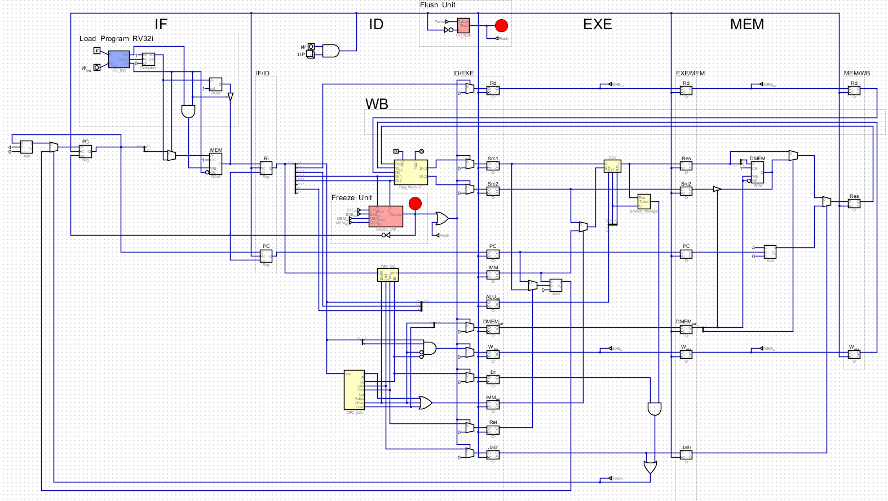

# RV32I Pipelined CPU (5 stages)

Implémentation d’un processeur **RISC-V RV32I** pipeliné en **5 étages classiques**, réalisée avec **Digital (hneemann)**.

---

## Aperçu

Ce projet implémente un CPU RV32I avec pipeline :

* IF – Instruction Fetch
* ID – Instruction Decode
* EXE – Execute
* MEM – Memory
* WB – Write Back

Le design inclut des mécanismes pour gérer les hazards :

* Freeze Unit : gestion des data hazards (stalls)
* Flush Unit : gestion des control hazards (branches/jumps)

---

## Architecture

Le pipeline est structuré avec des registres intermédiaires :

* `IF/ID`
* `ID/EX`
* `EX/MEM`
* `MEM/WB`

### Gestion des hazards

#### Data Hazards

* Détectés par la Freeze Unit
* Insertion de stalls (gel du pipeline)

#### Control Hazards

* Gérés via la Flush Unit
* Invalidation des instructions spéculatives

---

## Blocs principaux (.dig)

Description des modules principaux :

### `IMM_dec`

Décode les immédiats selon le format d’instruction (I, S, B, J...).

### `Reg_file_rv32i`

Banc de registres RV32I :

* 32 registres 32 bits
* Lecture double + écriture simple
* `x0` toujours à 0

### `OPC_dec`

Décode l’opcode et génère les signaux de contrôle :

* type d’instruction
* activation ALU / mémoire / writeback

### `ALU`

Unité arithmétique et logique :

* add, sub, and, or, xor, shifts
* comparaisons pour les branches

### `Branch_manager`

Gère :

* décisions de branchement
* calcul des cibles (PC)
* signal "taken / not taken"

### `Freeze_Unit`

Détecte les dépendances de données :

* comparaison des registres source/destination
* blocage du pipeline si nécessaire (stall)

### `CC_flush`

Unité de flush :

* invalide les instructions après un branch ou jump
* évite l’exécution incorrecte

### `CC_lpg`

Chargeur de programme :

* copie un programme depuis une ROM vers la RAM
* utilisé pour initialiser la mémoire d’instructions

---

## Comment tester ?

### 1. Installer Digital

Télécharger le simulateur :
https://github.com/hneemann/Digital

### 2. Ouvrir le projet

* Lancer Digital
* Ouvrir le fichier principal `CPU.dig`
* Lancer la simulation

### 3. Charger un programme

* Utiliser le module `CC_lpg` via l'entrée `W_lpg`
* Laisser Charger le programme dans la RAM

### 4. Lancer la simulation

* Mode step-by-step recommandé
* Activer le signal `W` puis presser la touche `UP` du clavier pour faire avancer le pipeline
* Observer :

  * PC
  * registres
  * pipeline (IF → WB)

### 5. Vérifications utiles

* exécution correcte des instructions RV32I
* comportement des branches
* stalls lors des dépendances
* flush après un jump ou branch
* vérifier le détail de l'execution dans `program_asm.txt`

---

## Fonctionnalités

* Pipeline 5 étages
* Support RV32I de base
* Gestion des data hazards (stall)
* Gestion des control hazards (flush)
* Chargement automatique de programme

---

## Licence

Libre d’utilisation pour projets éducatifs.
